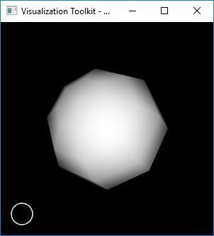

# VTK Ellipse Widget

A VTK widget to place ellipse shape bounded by a 2D rectangular region.

 

## Ellipse Widget
Place an ellipse enclosed within a 2D rectangular region

This class is a superclass for 2D widgets that may require an ellipse region. Besides drawing an ellipse, the widget provides methods for resizing and moving the ellipse. The widget provides methods and internal data members so that subclasses can take advantage of this widgets capabilities, requiring only that the subclass defines a "representation", i.e., some combination of props or actors that can be managed in the 2D ellipse region.

The class defines basic positioning functionality, including the ability to size the widget with locked x/y proportions. The area within the border may be made "selectable" as well, meaning that a selection event interior to the widget invokes a virtual SelectRegion() method, which can be used to pick objects or otherwise manipulate data interior to the widget.

## Ellipse Representation
Represent a vtkEllipseWidget

This class is used to represent and render a vtkEllipseWidget. To use this class, you need to specify the two corners that encloses an ellipse region.

The class is typically subclassed so that specialized representations can be created. The class defines an API and a default implementation that the vtkBorderRepresentation interacts with to render itself in the scene.

## Example

An example can be found from `EllipseWidget.cxx`. It draws an ellipse around a region selected with the mouse. Note that the default ellipse color is white - so if you have a white background you will not see anything!